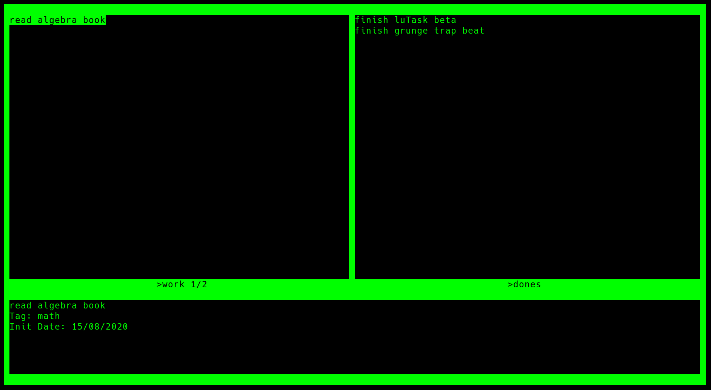

# luTask

## Simple list-making program implemented in C++

### Requirements
ncurses and standard C++ libraries

### Usage

Shortcut | Description | 
--- | --- |
<kbd>h</kbd> | Previous task |
<kbd>j</kbd> | Next task |
<kbd>k</kbd> | Previous task |
<kbd>l</kbd> | Next list |
<kbd>H</kbd> | Select pendings |
<kbd>L</kbd> | Select dones |
<kbd>d</kbd> | Delete task | 
<kbd>D</kbd> | Delete list | 
<kbd>r</kbd> | Rename task |
<kbd>R</kbd> | Rename list |
<kbd>a</kbd> | Add task |
<kbd>A</kbd> | Add list |
<kbd>Enter</kbd> | Finish Task or confirm insertion |
<kbd>ESC</kbd> | Close application |
